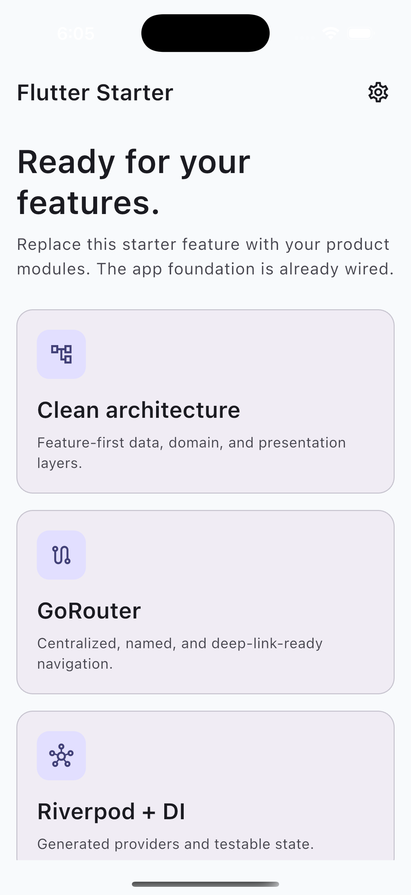
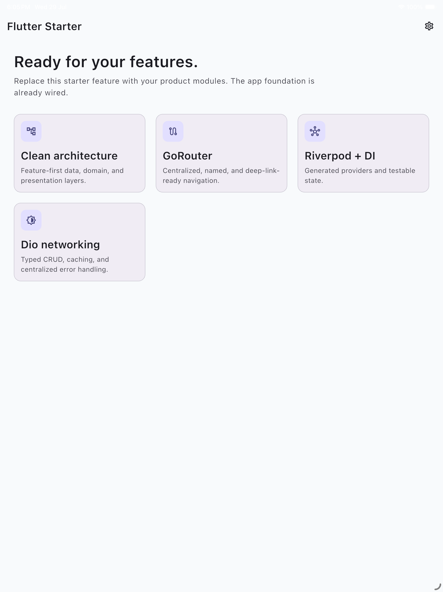
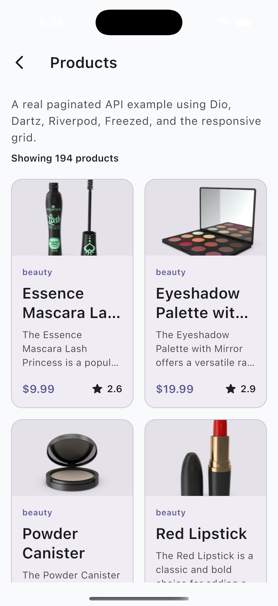
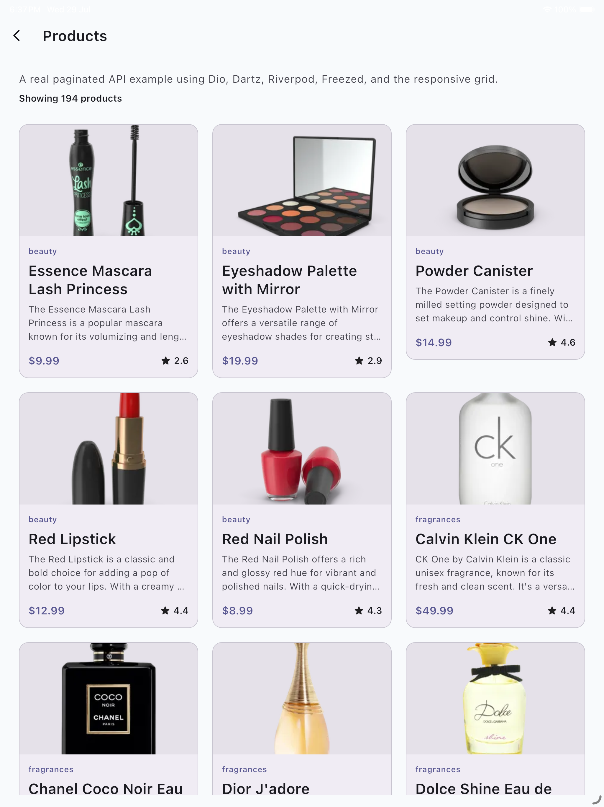

# Flutter Clean Architecture Starter

A ready-to-extend Flutter template with feature-first clean architecture,
generated Riverpod state and dependency injection, GoRouter, Dio networking,
Freezed models, generated localization, environment configuration, and
persisted Material 3 themes.

## Included

- Feature-first `data`, `domain`, and `presentation` layers
- Generated Riverpod providers and async notifiers
- Named GoRouter routes, nested navigation, and a 404 page
- Dio GET, POST, PUT, PATCH, and DELETE support
- Dio cache interceptor with configurable request policies
- Bearer-token interceptor ready for secure token storage
- Dartz `Either<Failure, T>` results
- Typed transport, HTTP, cache, serialization, and unknown failures
- Freezed immutable models with generated JSON serialization
- Development and production `dart-define` files
- English, Bangla, and Arabic localization with automatic RTL layout
- Persisted language selection with English as the default
- Persisted light, dark, and system theme selection
- Material 3 colors, typography, spacing, radii, and component themes
- Responsive small-phone, phone, tablet, and expanded layouts
- Adaptive spacing, typography, content widths, grids, and narrow controls
- Working paginated DummyJSON Products feature with pull-to-refresh
- Shared page and error widgets
- Strict analyzer rules plus unit and widget tests

## Main packages

| Area | Packages |
| --- | --- |
| State and DI | `flutter_riverpod`, `riverpod_annotation`, `riverpod_generator` |
| Navigation | `go_router` |
| Networking | `dio`, `dio_cache_interceptor` |
| Functional results | `dartz` |
| Models | `freezed_annotation`, `freezed`, `json_annotation`, `json_serializable` |
| Persistence | `shared_preferences` |
| Localization | `flutter_localizations`, `intl`, Flutter `gen-l10n` |
| Generation | `build_runner` |

## Project structure

```text
.
├── config/
│   ├── dev.json
│   └── prod.json
├── l10n.yaml                     # Flutter gen-l10n configuration
├── lib/
│   ├── app/
│   │   ├── bootstrap.dart
│   │   ├── router/
│   │   └── template_app.dart
│   ├── core/
│   │   ├── config/               # Compile-time environment values
│   │   ├── constants/            # Shared spacing and layout tokens
│   │   ├── di/                   # Generated application providers
│   │   ├── error/                # Failure types
│   │   ├── extensions/           # Shared extensions
│   │   ├── localization/         # Supported locales, persistence, notifier
│   │   ├── network/              # Dio, CRUD, cache, auth, error mapping
│   │   ├── responsive/           # Breakpoints, metrics, values, layout widgets
│   │   ├── theme/                # ThemeData, tokens, persistence, notifier
│   │   └── widgets/              # App-wide widgets
│   ├── l10n/                     # ARB resources and generated localizations
│   ├── features/
│   │   ├── home/                 # Local template overview
│   │   └── products/             # Complete paginated API example
│   │       ├── data/
│   │       │   ├── datasources/
│   │       │   ├── models/
│   │       │   └── repositories/
│   │       ├── domain/
│   │       │   ├── entities/
│   │       │   ├── repositories/
│   │       │   └── usecases/
│   │       └── presentation/
│   │           ├── pages/
│   │           ├── providers/
│   │           └── widgets/
│   └── main.dart
└── test/
```

Dependencies point toward the domain:

```text
presentation → domain ← data
```

- `domain` contains business entities, repository contracts, and use cases.
- `data` contains Freezed models, data sources, mapping, and repository
  implementations.
- `presentation` contains generated Riverpod notifiers, pages, and widgets.
- `core` contains infrastructure shared by multiple features.

Keep feature-specific code out of `core`.

## Responsive layout

Responsive decisions use available logical width instead of platform or device
names. Do not maintain separate screens for individual devices.

| Window class | Width | Typical use |
| --- | ---: | --- |
| Small phone | `< 360` | Compact spacing and stacked controls |
| Phone | `360–599` | Standard mobile layout |
| Tablet | `600–839` | Wider content and multiple columns |
| Expanded | `≥ 840` | Tablet landscape and larger windows |

### Responsive preview

The same Home content changes from a single-column phone layout to a
three-column tablet layout without maintaining separate screens:

| Phone | Tablet |
| --- | --- |
|  |  |

Shared implementation lives in `lib/core/responsive/`:

- `AppBreakpoints` maps a logical width to an `AppWindowSize`.
- `ResponsiveValue<T>` keeps breakpoint-specific values declarative.
- `AppResponsiveMetrics` provides page padding, card padding, and layout gaps.
- `ResponsiveBuilder` exposes those metrics from current constraints.
- `ResponsiveGrid` lays out a small, already-loaded collection.
- `ResponsiveSliverGrid` lazily builds rows inside a custom scroll view.
- `PaginatedResponsiveGridView` requests API pages near the scroll boundary.
- `ResponsiveConstrainedBox` keeps content centered and readable.

Typical imports for a responsive presentation page:

```dart
import 'package:ag_pos/core/constants/app_sizes.dart';
import 'package:ag_pos/core/extensions/build_context_extensions.dart';
import 'package:ag_pos/core/responsive/app_breakpoints.dart';
import 'package:ag_pos/core/responsive/paginated_responsive_grid_view.dart';
import 'package:ag_pos/core/responsive/responsive_builder.dart';
import 'package:ag_pos/core/responsive/responsive_value.dart';
import 'package:ag_pos/core/widgets/app_page.dart';
import 'package:flutter/material.dart';
```

The product types, callbacks, widgets, and localization keys in the following
examples are illustrative. Add the feature-specific ARB messages and replace
the placeholders when implementing a real feature.

### Create a standard screen

Start new presentation pages with `AppPage`. It supplies the shared scaffold,
safe area, app bar, and centered maximum content width. The screen remains
responsible for its scroll behavior and responsive padding:

```dart
class ProductPage extends StatelessWidget {
  const ProductPage({super.key});

  @override
  Widget build(BuildContext context) {
    return AppPage(
      title: context.locale.productsTitle,
      body: ResponsiveBuilder(
        builder: (context, metrics) {
          return ListView(
            padding: EdgeInsets.symmetric(
              horizontal: metrics.horizontalPadding,
              vertical: metrics.verticalPadding,
            ),
            children: [
              Text(
                context.locale.productsTitle,
                style: Theme.of(context).textTheme.headlineLarge,
              ),
              SizedBox(height: metrics.sectionGap),
              // Feature content.
            ],
          );
        },
      ),
    );
  }
}
```

`ResponsiveBuilder` exposes:

```dart
metrics.width
metrics.windowSize
metrics.horizontalPadding
metrics.verticalPadding
metrics.cardPadding
metrics.gridGap
metrics.sectionGap

metrics.isSmallPhone
metrics.isPhone
metrics.isTablet
```

### Choose a content width

Use the narrowest width appropriate for the content:

| Token | Width | Use |
| --- | ---: | --- |
| `AppSizes.formMaxWidth` | `680` | Forms and settings |
| `AppSizes.readableTextMaxWidth` | `720` | Articles and long descriptions |
| `AppSizes.contentMaxWidth` | `1100` | Dashboards and responsive grids |
| `AppSizes.cardMinWidth` | `280` | Minimum grid-card width |

A form should not stretch across an entire tablet:

```dart
return AppPage(
  title: context.locale.createProductTitle,
  maxContentWidth: AppSizes.formMaxWidth,
  body: ResponsiveBuilder(
    builder: (context, metrics) {
      return ListView(
        padding: EdgeInsets.symmetric(
          horizontal: metrics.horizontalPadding,
          vertical: metrics.verticalPadding,
        ),
        children: [
          const TextField(),
          SizedBox(height: metrics.gridGap),
          const TextField(),
          SizedBox(height: metrics.sectionGap),
          FilledButton(
            onPressed: saveProduct,
            child: Text(context.locale.save),
          ),
        ],
      );
    },
  ),
);
```

### Create a responsive grid

Use `ResponsiveGrid` rather than checking a device model or manually assigning
columns:

```dart
ResponsiveGrid(
  minimumItemWidth: AppSizes.cardMinWidth,
  maximumColumns: 3,
  spacing: metrics.gridGap,
  children: products.map((product) {
    return ProductCard(product: product);
  }).toList(),
)
```

The grid calculates how many minimum-width cards fit. A small phone normally
gets one column, a tablet normally gets two, and an expanded layout can get
three. Available width, not the platform name, determines the final result.

`ResponsiveGrid` uses `Wrap` and receives an existing list of widgets. Use it
for short static collections such as dashboard shortcuts or settings cards. It
builds every child, so do not use it for an unbounded API result.

Choose the grid component by ownership and data size:

| Component | Use when |
| --- | --- |
| `ResponsiveGrid` | The collection is small, static, and already loaded |
| `ResponsiveSliverGrid` | A custom sliver screen needs lazy grid construction |
| `PaginatedResponsiveGridView` | A normal API-backed grid needs pagination |

The sample Products feature uses this explicit policy:

| Device width | Product columns |
| --- | ---: |
| Below `360` | 1 |
| `360–599` | 2 |
| `600` and above | 3 |

It keeps the small-phone card width comfortable while allowing denser product
layouts elsewhere:

```dart
const productCardMinimumWidth = ResponsiveValue<double>(
  smallPhone: AppSizes.cardMinWidth,
  phone: 148,
  tablet: 148,
  expanded: 148,
);
```

The value is passed to the grid:

```dart
minimumItemWidth: productCardMinimumWidth.resolve(metrics.windowSize),
maximumColumns: 3,
```

The grid still checks its actual constraints, so it can reduce the column count
instead of overflowing if a parent supplies less width than expected.

### Paginate an API-backed grid

Use `PaginatedResponsiveGridView` for a growing API result. It combines a
`CustomScrollView` with `ResponsiveSliverGrid`, so only visible rows are built.
It preserves content-driven card height instead of forcing localized text into
a fixed grid aspect ratio.

The widget handles presentation-level pagination behavior:

- Responsive 1–3 column layout
- Lazy row construction
- Next-page request near the end of the scroll extent
- Automatic next-page request when loaded content does not fill the viewport
- Duplicate in-flight request protection
- Loading, pagination-error, empty, and end-of-list presentation
- Paused automatic retry while `loadMoreError` is present

The feature's Riverpod controller remains responsible for:

- Fetching the first page
- Calling its repository or use case
- Tracking the next page or cursor
- Appending and deduplicating items
- Updating `hasMore` and `isLoadingMore`
- Converting `Failure` objects into feature state
- Retrying a failed request

A feature pagination state normally contains:

```dart
@freezed
abstract class ProductListState with _$ProductListState {
  const factory ProductListState({
    @Default(<Product>[]) List<Product> items,
    @Default(true) bool hasMore,
    @Default(false) bool isLoadingMore,
    Failure? loadMoreFailure,
    String? nextCursor,
  }) = _ProductListState;
}
```

The page passes that state to the grid:

```dart
class ProductPage extends ConsumerWidget {
  const ProductPage({super.key});

  @override
  Widget build(BuildContext context, WidgetRef ref) {
    final products = ref.watch(productsControllerProvider);

    return AppPage(
      title: context.locale.productsTitle,
      body: products.when(
        loading: () => const Center(child: CircularProgressIndicator()),
        error: (error, stackTrace) => AppErrorView(
          message: context.locale.productsLoadError,
          onRetry: () => ref.invalidate(productsControllerProvider),
        ),
        data: (state) {
          return ResponsiveBuilder(
            builder: (context, metrics) {
              return PaginatedResponsiveGridView(
                itemCount: state.items.length,
                itemBuilder: (context, index) {
                  final product = state.items[index];
                  return ProductCard(
                    key: ValueKey(product.id),
                    product: product,
                  );
                },
                hasMore: state.hasMore,
                isLoadingMore: state.isLoadingMore,
                onLoadMore: () {
                  return ref
                      .read(productsControllerProvider.notifier)
                      .loadNextPage();
                },
                minimumItemWidth: productCardMinimumWidth.resolve(
                  metrics.windowSize,
                ),
                maximumColumns: 3,
                spacing: metrics.gridGap,
                padding: EdgeInsets.symmetric(
                  horizontal: metrics.horizontalPadding,
                  vertical: metrics.verticalPadding,
                ),
                emptyState: Center(
                  child: Text(context.locale.productsEmpty),
                ),
                loadMoreError: state.loadMoreFailure == null
                    ? null
                    : Padding(
                        padding: const EdgeInsets.all(AppSizes.space16),
                        child: Center(
                          child: FilledButton.tonal(
                            onPressed: () {
                              ref
                                  .read(
                                    productsControllerProvider.notifier,
                                  )
                                  .loadNextPage();
                            },
                            child: Text(context.locale.tryAgain),
                          ),
                        ),
                      ),
              );
            },
          );
        },
      ),
    );
  }
}
```

The first page should use the controller's top-level `AsyncLoading` and
`AsyncError` states. After data is visible, keep the existing items on screen
while `isLoadingMore` is true. Store a later-page failure in
`loadMoreFailure`; do not replace the whole screen with an error page.

`onLoadMore` must return the controller's `Future<void>`. The grid guards that
future so repeated scroll notifications cannot start duplicate requests.

### Compose a custom sliver screen

Use `ResponsiveSliverGrid` directly when the feature already owns a
`CustomScrollView` and needs several sections to scroll as one surface. Typical
examples include:

- A collapsible or pinned `SliverAppBar`
- Search and filter sections
- Promotional banners
- A responsive product grid
- Another list below the grid
- A feature-specific pagination footer

```dart
CustomScrollView(
  slivers: [
    const SliverAppBar(
      pinned: true,
      title: Text('Products'),
    ),
    const SliverToBoxAdapter(
      child: ProductSearchBar(),
    ),
    SliverPadding(
      padding: const EdgeInsets.all(AppSizes.space16),
      sliver: ResponsiveSliverGrid(
        itemCount: products.length,
        minimumItemWidth: AppSizes.cardMinWidth,
        maximumColumns: 3,
        spacing: AppSizes.space16,
        itemBuilder: (context, index) {
          return ProductCard(
            key: ValueKey(products[index].id),
            product: products[index],
          );
        },
      ),
    ),
    const SliverToBoxAdapter(
      child: ProductPaginationFooter(),
    ),
  ],
)
```

`ResponsiveSliverGrid` only handles lazy responsive layout. It does not own a
scroll controller or automatically request another page. This is useful when
the containing feature has custom scroll behavior or pagination rules.

For example, a feature can own the scroll controller:

```dart
class ProductPage extends StatefulWidget {
  const ProductPage({super.key});

  @override
  State<ProductPage> createState() => _ProductPageState();
}

class _ProductPageState extends State<ProductPage> {
  final _scrollController = ScrollController();

  @override
  void initState() {
    super.initState();
    _scrollController.addListener(_handleScroll);
  }

  void _handleScroll() {
    if (!_scrollController.hasClients) {
      return;
    }

    final position = _scrollController.position;
    if (position.extentAfter < 400) {
      // Call the Riverpod controller. The controller must guard against
      // duplicate requests and stop when hasMore is false.
    }
  }

  @override
  void dispose() {
    _scrollController
      ..removeListener(_handleScroll)
      ..dispose();
    super.dispose();
  }

  @override
  Widget build(BuildContext context) {
    return CustomScrollView(
      controller: _scrollController,
      slivers: [
        ResponsiveSliverGrid(
          itemCount: products.length,
          itemBuilder: (context, index) {
            return ProductCard(product: products[index]);
          },
        ),
      ],
    );
  }
}
```

Prefer `PaginatedResponsiveGridView` when this custom control is unnecessary;
it already implements the scroll threshold and duplicate-request guard.

#### Why not use a standard `SliverGrid`?

A standard `SliverGrid` commonly uses a fixed aspect ratio or fixed row extent.
That can become unsafe when:

- Bangla or Arabic text occupies additional lines
- Accessibility text scaling is enabled
- Cards contain optional information
- Different records need different amounts of vertical space

`ResponsiveSliverGrid` creates lazy, content-driven rows. The next row begins
after the tallest card in the previous row, so text is not forced into a fixed
card height. Cards within a row may have different visible heights.

#### Sliver nesting rules

A sliver cannot be placed in the regular `children` collection of `ListView`,
`Column`, or `SingleChildScrollView`.

Incorrect:

```dart
ListView(
  children: [
    ResponsiveSliverGrid(
      itemCount: products.length,
      itemBuilder: buildProduct,
    ),
  ],
)
```

Also incorrect:

```dart
SingleChildScrollView(
  child: ResponsiveSliverGrid(
    itemCount: products.length,
    itemBuilder: buildProduct,
  ),
)
```

Correct:

```dart
CustomScrollView(
  slivers: [
    ResponsiveSliverGrid(
      itemCount: products.length,
      itemBuilder: buildProduct,
    ),
  ],
)
```

The practical rule is:

- Static dashboard cards → `ResponsiveGrid`
- Normal paginated API grid → `PaginatedResponsiveGridView`
- Advanced `CustomScrollView` composition → `ResponsiveSliverGrid`

### Switch between mobile and tablet structures

Use separate `Column` and `Row` branches when the structure must change:

```dart
ResponsiveBuilder(
  builder: (context, metrics) {
    if (metrics.isPhone) {
      return const Column(
        children: [
          ProductDetails(),
          SizedBox(height: AppSizes.space16),
          ProductSummary(),
        ],
      );
    }

    return const Row(
      crossAxisAlignment: CrossAxisAlignment.start,
      children: [
        Expanded(child: ProductDetails()),
        SizedBox(width: AppSizes.space24),
        Expanded(child: ProductSummary()),
      ],
    );
  },
)
```

Do not reuse an `Expanded` child from the tablet `Row` inside an unbounded
mobile `Column`.

### Select a value by breakpoint

Use `ResponsiveValue<T>` when a component genuinely needs explicit values for
every window class:

```dart
const imageHeight = ResponsiveValue<double>(
  smallPhone: 160,
  phone: 200,
  tablet: 260,
  expanded: 320,
);

final height = imageHeight.resolve(metrics.windowSize);
```

Prefer constraint-based widgets such as `ResponsiveGrid` when possible. Use
`ResponsiveValue` for dimensions, counts, or component variants that cannot be
derived naturally from constraints.

### Build content-driven cards

Cards must grow with localized and accessibility text. Use responsive padding
and avoid a fixed height:

```dart
class ProductCard extends StatelessWidget {
  const ProductCard({required this.product, super.key});

  final Product product;

  @override
  Widget build(BuildContext context) {
    return ResponsiveBuilder(
      builder: (context, metrics) {
        return Card(
          child: Padding(
            padding: EdgeInsets.all(metrics.cardPadding),
            child: Column(
              crossAxisAlignment: CrossAxisAlignment.start,
              children: [
                Text(
                  product.name,
                  style: Theme.of(context).textTheme.titleLarge,
                ),
                const SizedBox(height: AppSizes.space8),
                Text(product.description),
              ],
            ),
          ),
        );
      },
    );
  }
}
```

### Keep text safe inside rows

Text placed beside an icon, image, button, or other fixed-width child should
normally be wrapped in `Expanded` or `Flexible`:

```dart
Row(
  children: [
    const Icon(Icons.inventory_2_outlined),
    const SizedBox(width: AppSizes.space12),
    Expanded(
      child: Text(
        product.name,
        maxLines: 2,
        overflow: TextOverflow.ellipsis,
      ),
    ),
  ],
)
```

Use ellipsis only when losing content is acceptable. Important descriptions
should wrap naturally:

```dart
Expanded(child: Text(product.description))
```

### Adapt controls with long labels

Controls that place several translated labels horizontally need a compact
alternative. The Settings theme selector uses a vertical selector below
`AppBreakpoints.segmentedControl`. A dropdown is another suitable option:

```dart
ResponsiveBuilder(
  builder: (context, metrics) {
    if (metrics.width < AppBreakpoints.segmentedControl) {
      return DropdownButtonFormField<ProductStatus>(
        isExpanded: true,
        items: statusItems,
        onChanged: onStatusChanged,
      );
    }

    return SegmentedButton<ProductStatus>(
      segments: statusSegments,
      selected: {selectedStatus},
      onSelectionChanged: (selection) {
        onStatusChanged(selection.first);
      },
    );
  },
)
```

Buttons and other interactive controls should retain a minimum touch target of
48 logical pixels.

### Typography and accessibility

Use `Theme.of(context).textTheme` instead of calculating font sizes from screen
width:

```dart
Text(
  context.locale.productsTitle,
  style: Theme.of(context).textTheme.headlineLarge,
)
```

The template increases typography modestly on tablets and expanded windows.
Flutter's `MediaQuery` text scaling is applied afterwards, so the user's
accessibility setting remains effective.

Avoid:

```dart
// Do not scale text directly from the screen width.
fontSize: MediaQuery.sizeOf(context).width * 0.04
```

Do not use `FittedBox` to force normal body text into a small area; it can make
text unreadably small.

### Complete screen example

This is the recommended starting structure for a new list or dashboard screen:

```dart
class ExamplePage extends StatelessWidget {
  const ExamplePage({super.key});

  @override
  Widget build(BuildContext context) {
    return AppPage(
      title: context.locale.appName,
      body: ResponsiveBuilder(
        builder: (context, metrics) {
          return ListView(
            padding: EdgeInsets.symmetric(
              horizontal: metrics.horizontalPadding,
              vertical: metrics.verticalPadding,
            ),
            children: [
              ConstrainedBox(
                constraints: const BoxConstraints(
                  maxWidth: AppSizes.readableTextMaxWidth,
                ),
                child: Text(
                  context.locale.homeReadyDescription,
                  style: Theme.of(context).textTheme.bodyLarge,
                ),
              ),
              SizedBox(height: metrics.sectionGap),
              ResponsiveGrid(
                minimumItemWidth: AppSizes.cardMinWidth,
                spacing: metrics.gridGap,
                children: const [
                  ExampleCard(),
                  ExampleCard(),
                  ExampleCard(),
                ],
              ),
            ],
          );
        },
      ),
    );
  }
}
```

### Implement a Figma design

When implementing a Figma screen:

1. Map Figma color and text styles to theme tokens rather than copying raw
   values into a page.
2. Treat 320, 390, 768, and 1024-pixel frames as reference states, not separate
   screens.
3. Translate Auto Layout behavior into `Row`, `Column`, `Flexible`, `Wrap`, and
   `ResponsiveGrid`.
4. Prefer start/end alignment so Arabic mirrors automatically.
5. Test content-driven height with long Bangla and Arabic copy.
6. Replace wide controls with a stacked or dropdown variant when their labels
   cannot fit; the Settings theme selector demonstrates this pattern.

Do not globally scale a Figma frame or use `FittedBox` for body text. Select
layout, spacing, and component variants from constraints and let text wrap.

### Responsive testing checklist

Before finishing a screen, verify:

- `320 × 568`: small phone
- `390 × 844`: normal phone
- `600 × 960`: small tablet
- `1024 × 768`: expanded tablet
- English, Bangla, and Arabic
- Arabic right-to-left alignment
- At least `2×` accessibility text scaling
- No Flutter layout exceptions from `tester.takeException()`

The template already covers a 320×568 small phone at 2× text scale, Bangla
compact settings, and a 1024×768 Arabic RTL tablet:

```sh
flutter test test/core/responsive test/widget_test.dart
```

## Getting started

```sh
flutter pub get
flutter gen-l10n
dart run build_runner build
flutter run --dart-define-from-file=config/dev.json
```

Generated localization, `.g.dart`, and `.freezed.dart` files are part of the
source tree. Do not edit generated files manually.

## Localization

The template currently supports:

| Language | Locale | Direction |
| --- | --- | --- |
| English | `en` | LTR |
| Bangla | `bn` | LTR |
| Arabic | `ar` | RTL |

English is the explicit first-run default, even when the device uses another
language. Selecting a language in Settings updates the application immediately
and persists the choice with `SharedPreferencesAsync`. The saved locale is
restored during bootstrap before the first frame. Missing, unsupported, invalid,
or unreadable values fall back to English.

Use localized strings in presentation and shared widgets through the
`BuildContext` extension:

```dart
Text(context.locale.settingsTitle)
```

For several messages in one build method, keep a local reference:

```dart
final l10n = context.locale;

return Column(
  children: <Widget>[
    Text(l10n.settingsTitle),
    Text(l10n.languageDescription),
  ],
);
```

Keep user-facing presentation text in ARB resources. Domain entities and data
models should not depend on `AppLocalizations`; translate display text at the
presentation boundary.

### Localization files

Editable translation resources:

```text
lib/l10n/
├── app_en.arb
├── app_bn.arb
└── app_ar.arb
```

Generated files:

```text
lib/l10n/
├── app_localizations.dart
├── app_localizations_en.dart
├── app_localizations_bn.dart
└── app_localizations_ar.dart
```

`app_en.arb` is the template configured in `l10n.yaml`. Add a message there,
provide the same key in Bangla and Arabic, and then regenerate:

```sh
flutter gen-l10n
```

Example message with a placeholder:

```json
{
  "welcomeUser": "Welcome, {name}",
  "@welcomeUser": {
    "description": "Greeting shown after login",
    "placeholders": {
      "name": {
        "type": "String"
      }
    }
  }
}
```

Presentation usage:

```dart
Text(context.locale.welcomeUser(user.name))
```

### Locale state and persistence

Localization infrastructure is split by responsibility:

- `app_locales.dart`: supported locales and English fallback.
- `locale_preferences.dart`: `SharedPreferencesAsync` persistence.
- `locale_controller.dart`: generated Riverpod state and save behavior.
- `build_context_extensions.dart`: the `context.locale` presentation helper.
- `bootstrap.dart`: restores the saved locale before `runApp`.
- `template_app.dart`: delegates, supported locales, and current locale.

Change the language from presentation code:

```dart
await ref
    .read(localeControllerProvider.notifier)
    .setLocale(AppLocales.bangla);
```

Only locales in `AppLocales.supported` are accepted. Selecting the active locale
again does not perform another storage write.

### Adding another language

1. Create its ARB file, such as `lib/l10n/app_es.arb`.
2. Translate every message defined by `app_en.arb`.
3. Add its `Locale` constant and list entry in `AppLocales`.
4. Add its localized display-name message to every ARB file.
5. Add it to the Settings language selector.
6. Add the locale code to `CFBundleLocalizations` in
   `ios/Runner/Info.plist`.
7. Run `flutter gen-l10n`.
8. Add fallback, persistence, rendering, and directionality tests as
   appropriate.

Flutter includes the generated localization delegate plus global Material,
Cupertino, and Widgets delegates. Because the selected locale is passed to
`MaterialApp`, Arabic automatically renders with right-to-left directionality.
No manual `Directionality` widget is required.

Localization tests cover the English fallback, supported-locale validation,
single-write persistence, Bangla rendering, and Arabic RTL directionality:

```sh
flutter test test/core/localization test/widget_test.dart
```

## Sample Products feature

The Home page links to `/products`, a complete reference feature backed by the
free [DummyJSON Products API](https://dummyjson.com/docs/products). It requires
no account or authentication and supports pagination through `limit` and
`skip`.

### Products responsive preview

The Products feature uses two columns on a regular phone and three columns on a
tablet while sharing the same page, controller, and pagination implementation:

| Phone — 2 columns | Tablet — 3 columns |
| --- | --- |
|  |  |

The example demonstrates:

- Dio requests through the shared `NetworkService`
- `limit`, `skip`, and response-field selection
- Dartz `Either<Failure, ProductPageResult>`
- Freezed API models and paginated presentation state
- Data-model-to-domain-entity mapping
- Repository and use-case boundaries
- Generated Riverpod dependency injection and async controller
- First-page loading/error and later-page loading/error separation
- Item deduplication while appending pages
- Pull-to-refresh
- `PaginatedResponsiveGridView` with lazy responsive rows
- English, Bangla, and Arabic presentation strings
- A named GoRouter route from Home

The endpoint used by the remote data source is:

```text
GET /products?limit=12&skip=0&select=id,title,description,category,price,rating,thumbnail
```

Use this feature as the reference when adding a real API-backed module. Replace
the sample base URL and response models while keeping the domain, repository,
controller, and presentation boundaries.

Products coverage includes response decoding, request parameters, first and
later pages, later-page failure preservation, responsive pagination, and route
navigation:

```sh
flutter test test/features/products test/core/responsive test/widget_test.dart
```

## Environment configuration

The application reads compile-time values through `AppConfig`.

`config/dev.json`:

```json
{
  "APP_ENV": "development",
  "API_BASE_URL": "https://dummyjson.com"
}
```

`config/prod.json`:

```json
{
  "APP_ENV": "production",
  "API_BASE_URL": "https://dummyjson.com"
}
```

Both template configurations use DummyJSON so the Products example works
immediately. Replace these URLs with the appropriate development and production
API hosts when integrating the real backend.

Run development:

```sh
flutter run --dart-define-from-file=config/dev.json
```

Build a production App Bundle:

```sh
flutter build appbundle --release \
  --dart-define-from-file=config/prod.json
```

Build a production APK:

```sh
flutter build apk --release \
  --dart-define-from-file=config/prod.json
```

These files must contain public build-time configuration only. Values compiled
into a client application can be extracted, so never place secrets in them.

## Networking

Remote data sources should receive `NetworkService` through constructor
injection. Do not create separate Dio instances inside features.

```dart
class UserRemoteDataSource {
  const UserRemoteDataSource(this._networkService);

  final NetworkService _networkService;

  Future<Either<Failure, UserModel>> getUser(int id) {
    return _networkService.get<UserModel>(
      '/users/$id',
      decoder: (data) {
        return UserModel.fromJson(data! as Map<String, dynamic>);
      },
    );
  }

  Future<Either<Failure, UserModel>> createUser(
    Map<String, dynamic> body,
  ) {
    return _networkService.post<UserModel>(
      '/users',
      data: body,
      decoder: (data) {
        return UserModel.fromJson(data! as Map<String, dynamic>);
      },
    );
  }
}
```

Register the data source with a generated provider:

```dart
part 'user_providers.g.dart';

@riverpod
UserRemoteDataSource userRemoteDataSource(Ref ref) {
  return UserRemoteDataSource(ref.watch(networkServiceProvider));
}
```

### CRUD API

Every method requires a typed decoder and returns
`Future<Either<Failure, T>>`.

| Method | Body | Query parameters | Cache policy |
| --- | --- | --- | --- |
| `get<T>` | No | Yes | Yes |
| `post<T>` | Yes | Yes | No |
| `put<T>` | Yes | Yes | No |
| `patch<T>` | Yes | Yes | No |
| `delete<T>` | Optional | Yes | No |

All methods also accept Dio `Options` and a `CancelToken`.

Decode a list response:

```dart
final result = await networkService.get<List<UserModel>>(
  '/users',
  queryParameters: <String, dynamic>{'page': 1},
  decoder: (data) {
    final items = data! as List<dynamic>;
    return items
        .map(
          (item) => UserModel.fromJson(item! as Map<String, dynamic>),
        )
        .toList(growable: false);
  },
);
```

Consume a result without exceptions:

```dart
return result.fold(
  (failure) {
    // Convert to feature state or return the failure from the repository.
    return Left(failure);
  },
  (users) {
    return Right(users.map((model) => model.toEntity()).toList());
  },
);
```

### Cache behavior

GET requests default to `RequestCachePolicy.useCache`.

```dart
await networkService.get<UserModel>(
  '/users/42',
  cachePolicy: RequestCachePolicy.refresh,
  decoder: (data) {
    return UserModel.fromJson(data! as Map<String, dynamic>);
  },
);
```

Available policies:

- `useCache`: respect server cache directives and use a cached response when
  appropriate.
- `refresh`: fetch from the server and refresh the cached entry.
- `noCache`: bypass the cache for that request.

The default store is a bounded in-memory LRU cache:

- Maximum total size: 10 MB
- Maximum entry size: 1 MB
- Maximum stale duration: 7 days
- Cached fallback on connection failure
- Cached fallback for HTTP 500, 502, 503, and 504
- POST caching disabled; other mutations are not cached

Override `cacheOptionsProvider` if the product requires a persistent or
encrypted cache.

### Authentication

`AuthInterceptor` reads a token from `AccessTokenProvider` and adds:

```text
Authorization: Bearer <token>
```

The template uses `EmptyAccessTokenProvider`, so unauthenticated requests work
without additional setup. When authentication is implemented, provide a secure
storage-backed implementation by overriding `authTokenSourceProvider`.

Do not store access or refresh tokens in `SharedPreferences`.

### Timeouts and logging

The Dio client has 30-second connection, send, and receive timeouts. A
`LogInterceptor` is enabled only in debug mode. Request bodies are available in
debug logs; response bodies are disabled, and no Dio logger is installed in
release builds.

## Error handling

Network and repository operations return `Either<Failure, T>`. Inspect
`failure.type` to produce feature-specific behavior.

| Failure type | Source |
| --- | --- |
| `connectionTimeout` | Connection could not be established in time |
| `sendTimeout` | Request upload timed out |
| `receiveTimeout` | Response or HTTP 408 timed out |
| `transformTimeout` | Dio response transformation timed out |
| `badCertificate` | TLS certificate validation failed |
| `cancelled` | Request was cancelled |
| `noConnection` | DNS, socket, or connectivity failure |
| `badRequest` | HTTP 400 or another unclassified 4xx response |
| `unauthorized` | HTTP 401 |
| `forbidden` | HTTP 403 |
| `notFound` | HTTP 404 |
| `conflict` | HTTP 409 |
| `validation` | HTTP 422 |
| `rateLimited` | HTTP 429 |
| `server` | HTTP 5xx |
| `cache` | Local data/cache operation failed |
| `serialization` | A response decoder rejected the payload |
| `unknown` | Any unexpected error |

The mapper retains server messages from `message`, `error`, `detail`, or
`title`. It also flattens common field-validation payloads under `errors`.

## Freezed models

Use Freezed for every data model/DTO. Keep domain entities independent of JSON
and infrastructure concerns.

```dart
part 'user_model.freezed.dart';
part 'user_model.g.dart';

@freezed
abstract class UserModel with _$UserModel {
  const factory UserModel({
    required int id,
    required String name,
  }) = _UserModel;

  const UserModel._();

  factory UserModel.fromJson(Map<String, dynamic> json) {
    return _$UserModelFromJson(json);
  }

  User toEntity() => User(id: id, name: name);
}
```

After adding or changing a model, regenerate its implementation.

## Riverpod annotations

Use `@riverpod` or `@Riverpod(keepAlive: true)` for every provider and notifier.
Do not manually construct `Provider`, `NotifierProvider`, or
`AsyncNotifierProvider`.

Function provider:

```dart
@riverpod
UserRepository userRepository(Ref ref) {
  return UserRepositoryImpl(ref.watch(userRemoteDataSourceProvider));
}
```

Async notifier:

```dart
@riverpod
class UsersController extends _$UsersController {
  @override
  Future<List<User>> build() async {
    final result = await ref.watch(getUsersProvider)();
    return result.fold(
      (failure) => throw StateError(failure.message),
      (users) => users,
    );
  }
}
```

Providers are auto-disposed by default. Use `keepAlive: true` only for
application-level dependencies that should live for the entire provider scope.

## Code generation

Generate once:

```sh
dart run build_runner build
```

Watch during development:

```sh
dart run build_runner watch
```

If stale generated files conflict, stop the watcher, remove only the affected
generated file, and run the build command again.

## Routing

Route paths and names live in `lib/app/router/app_routes.dart`. GoRouter
composition lives in `lib/app/router/app_router.dart`.

When adding a page:

1. Add its path and route name.
2. Register its `GoRoute`.
3. Navigate with `goNamed`, `pushNamed`, or typed path parameters.

Unknown routes render the shared 404 page.

## Theme and fonts

The default theme mode is `ThemeMode.system`. A user selection of system, light,
or dark is persisted with `SharedPreferencesAsync` and restored before the
first application frame. Missing, invalid, or unreadable values fall back to
system mode.

- Colors: `lib/core/theme/app_colors.dart`
- Typography: `lib/core/theme/app_typography.dart`
- Component themes: `lib/core/theme/app_theme.dart`
- Persistence: `lib/core/theme/theme_preferences.dart`
- Riverpod state: `lib/core/theme/theme_controller.dart`

The template uses the platform font. To add a brand font:

1. Add the font files under `assets/fonts/`.
2. Register them in `pubspec.yaml`.
3. Set `AppTypography.fontFamily`.

## Adding a feature

1. Create `data`, `domain`, and `presentation` folders.
2. Define domain entities and repository contracts.
3. Create Freezed data models and mapping methods.
4. Implement remote/local data sources using shared infrastructure.
5. Implement the repository and return `Either<Failure, T>`.
6. Add use cases.
7. Add annotated Riverpod providers/notifiers.
8. Register routes.
9. Run code generation.
10. Add unit and widget tests.

## Quality checks

```sh
dart format .
flutter gen-l10n
dart run build_runner build
flutter analyze
flutter test
```

Build verification:

```sh
flutter build apk --release \
  --dart-define-from-file=config/prod.json
```

## Release signing

The starter Android project currently uses the debug signing configuration for
release builds. Configure a private production keystore before publishing an
APK or App Bundle to Google Play.
